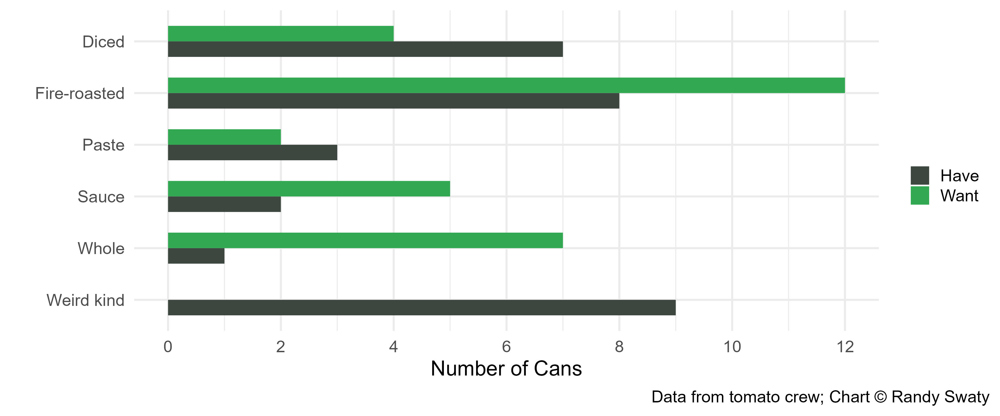
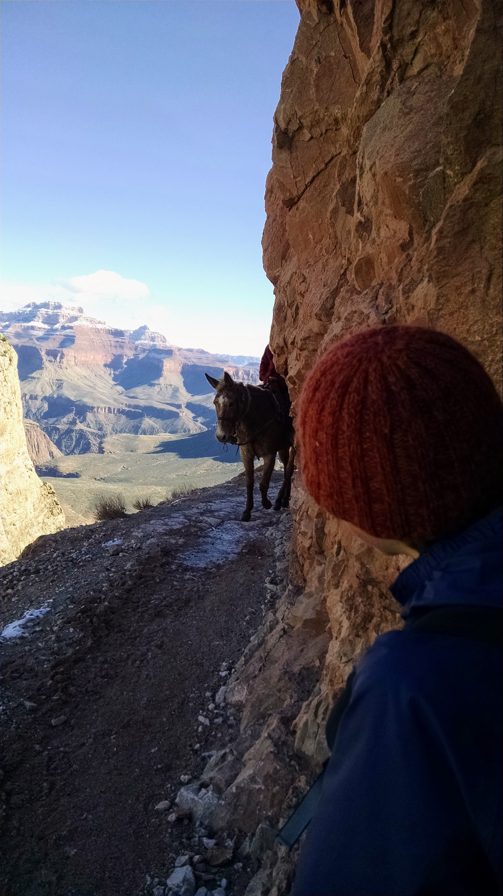
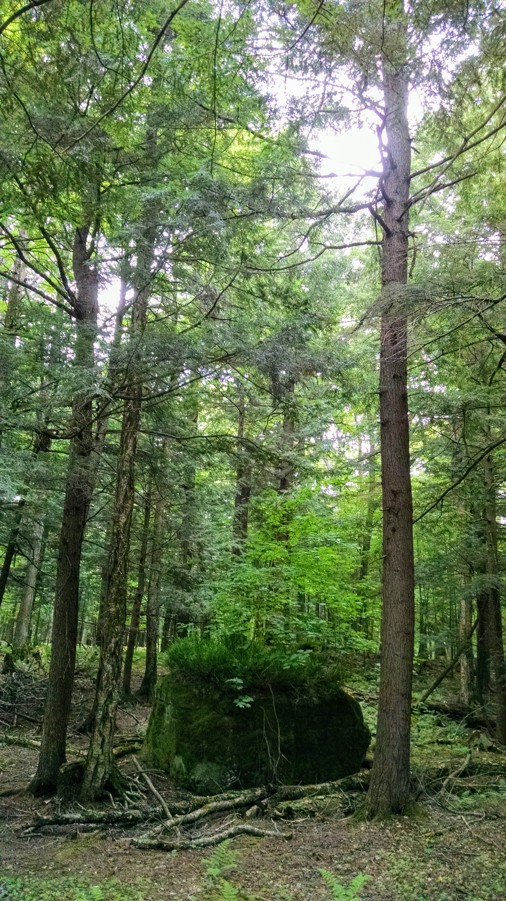
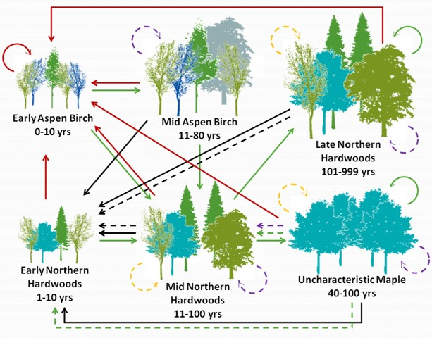

class: inverse, center, middle

# Fire, Forests and Fungi: Exploring the Condition of Our Ecosystems


```{r echo=FALSE, message=FALSE, warning=FALSE, out.width="60%", fig.align='center'}
knitr::include_graphics("images/grong.jpg")
```


Randy Swaty, Vanessa Carrasco Denney, and Jackie Carr

---

class: inverse, center, middle

# THANK YOU

yes I am yelling

---
class: inverse, center, middle

# What I do-at least at work

Ecologist for The Nature Conservancy's LANDFIRE team  

Founder and co-lead of the Conservation Data Lab

https://landfire.gov/ <br>
https://conservationdatalab.org/


---
class: inverse, center, middle

# Our next hour+ together

Tomato Condition Class (TCC)

Fungi

Vegetation Departure

Fire

---
class: inverse, center, middle

# Tomato Condition Class


```{r echo=FALSE, message=FALSE, warning=FALSE, out.width="90%", out.height="5%",  fig.align='center'}
knitr::include_graphics("images/tomatoes.png")
```


## <div align="center">What is the condition of our tomato stock?</div>

---
class: inverse, center, middle

# Canned Tomatoes

Paste (few)

Sauce (quite a few)

Diced (quite a few)

Whole (a lot)

Organic, free-range, cruelty-free fire-roasted (even more)


---
class: inverse, center, middle

# Fresh tomatoes

Romas (few)

Beefsteak (quite a few)

Cherry (quite a few)

Heirloom Brandywine (a lot)


---
class: inverse, center, middle

# Dried tomatoes

Home dehydrated (few)

Sun dried (quite a few)

<br>
<br>
<br>

## <div align="center">What do we do now that we know what we want?</div>

---
class: inverse, center, middle

# Canned Tomatoes: what we want vs. what we have


```{r toms inputs, echo=FALSE, message=FALSE, warning=FALSE}
library (tidyverse)
library (DT)


df <- read.csv("data/toms_data_only.csv")

datatable(df, 
          rownames = FALSE,
          extensions = 'FixedColumns',
          options = list(dom = 't'))  %>%
          formatStyle(names(df),
                background = 'lightblue', angle = -90,
                backgroundSize = '98% 88%',
                backgroundRepeat = 'no-repeat',
                backgroundPosition = 'center')


```


---
class: inverse, center, middle

# Canned Tomatoes: what we want vs. what we have


```{r make chart, eval=FALSE, fig.align='center', message=TRUE, warning=TRUE, include=FALSE, out.height='450px'}

toms <- read.csv("data/toms_data_only.csv")

toms_long <- toms %>%
  pivot_longer(cols = c('What.I.want', 'What.I.have'), 
               names_to = "sitch", 
               values_to = "cans")

# order classes
toms_long$Canned.tomato.type <- factor(toms_long$Canned.tomato.type, levels= c(
  "Diced",
  "Fire-roasted",
  "Paste",
  "Sauce",
  "Whole",
  "Weird kind"))


toms_plot <-
  ggplot(toms_long, aes(fill=factor(sitch), y=cans, x=Canned.tomato.type)) + 
  geom_col(width = 0.6, position = position_dodge()) +
  coord_flip() +
  scale_x_discrete(limits = rev) +
  labs(
    caption = "Data from tomato crew; Chart © Randy Swaty",
    x = "",
    y = "Number of Cans")+
  theme_minimal(base_size = 18)+
  theme(plot.title.position = "plot", #NEW parameter. Apply for subtitle too.
        plot.caption.position =  "plot") +
  scale_fill_manual(values = c("#3d4740", "#32a852" ), # present (grey), historical (green)
                    name = " ", 
                    labels = c("Have",
                               "Want")) +
  scale_y_continuous(breaks=c(0, 2, 4, 6, 8, 10, 12))

toms_plot

ggsave("toms_plot.jpg", width = 12, height = 5, bg = "white")
```


```{r echo=FALSE, message=FALSE, warning=FALSE, out.width="100%", fig.align='center'}

```


---
class: inverse, center, middle

# Getting there!


```{r toms least, echo=FALSE, message=FALSE, warning=FALSE}
library (tidyverse)
library (DT)


df <- read.csv("data/toms_data_plus_least.csv")

datatable(df, 
          rownames = FALSE,
          extensions = 'FixedColumns',
          options = list(dom = 't'))  %>%
          formatStyle(names(df),
                background = 'lightblue', angle = -90,
                backgroundRepeat = 'no-repeat',
                backgroundPosition = 'center')


```

<br>


**Sum(Potential cans) -  sum(Least) = Tomato Departure (TD, 30 - 17 = 13)**

---
class: inverse, center, middle

# Our Tomato Condition Class

Compares what we have to what we want

Uses math to do this (i.e., calculate Tomato Departure)

TCC breaks Tomato Departure into 3 classes: 0-10 = TCC 1, etc. 

We had a Tomato Departure of 13, for a TCC of 2.  

* We need fewer weird tomatoes, more fire-roasted and whole

---
class: inverse, center, middle

# Time to translate

Class of tomato ( e.g., 'canned')

Types within a class (e.g., "sauce")

"What we want"

"What we have"

"Weird type"

"Pantry"

<br>

## <div align="center">*What are the ecosystem/landscape analogues?*</div>

---
class: inverse, center, middle

# TNC and LANDFIRE


```{r echo=FALSE, message=FALSE, warning=FALSE, out.width="30%", fig.align='center'}

```


## <div align="center">*Mule Story, and what is this thing called 'LANDFIRE'*</div>

---
class: inverse, center, middle

# What is an ecosystem anyways


```{r echo=FALSE, message=FALSE, warning=FALSE, out.width="70%", fig.align='center'}
knitr::include_graphics("images/bps.jpg")
```

## <div align="center">*Map of ~1,000 ecosystems prior to European Colonization*</div>

---
class: inverse, center, top

# This is where things get complicated


```{r echo=FALSE, message=FALSE, warning=FALSE, out.width="30%", fig.align='center'}

```


---
class: inverse, center, top

# Amount wanted ("reference conditions")


```{r echo=FALSE, message=FALSE, warning=FALSE, out.width="70%", fig.align='center'}

```

## <div align="center">*Mycorrhizal fungi care about this*</div>

---
class: inverse, center, top

# Mapping what is there today


```{r echo=FALSE, message=FALSE, warning=FALSE, out.width="70%", fig.align='center'}
knitr::include_graphics("images/sclasses.jpg")
```

## <div align="center">*Combine with ecosystems map for current inventory*</div>
