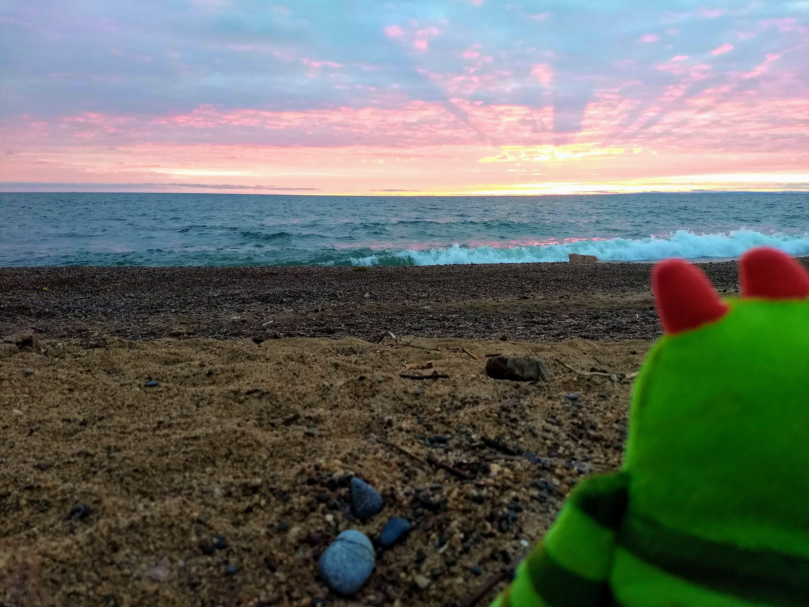
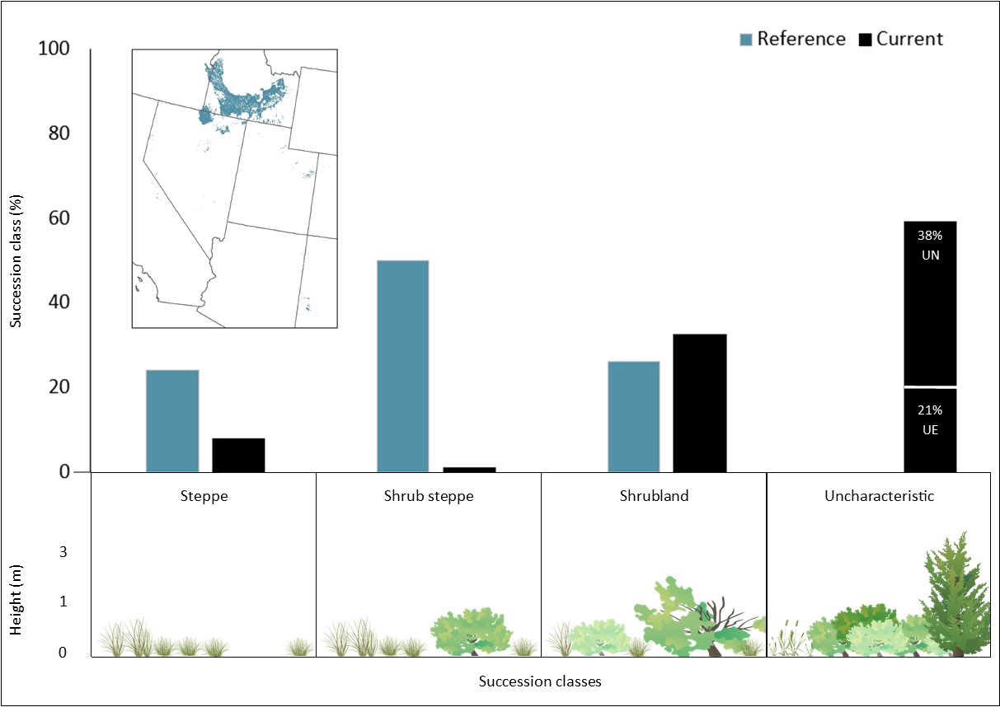

class: inverse, center, middle

# Fire, Forests and Fungi: Exploring the Condition of Our Ecosystems


```{r echo=FALSE, message=FALSE, warning=FALSE, out.width="60%", fig.align='center'}

```


Randy Swaty, Vanessa Carrasco Denney, and Jackie Carr

---

class: inverse, center, middle

# THANK YOU

yes I am yelling

---
class: inverse, center, top

# What I do-at least at work

<br>

Ecologist for The Nature Conservancy's LANDFIRE team  

Founder and co-lead of the Conservation Data Lab

https://landfire.gov/ <br>
https://conservationdatalab.org/

<br>

```{r echo=FALSE, message=FALSE, warning=FALSE, out.width="100%", out.height="5%",  fig.align='center'}
knitr::include_graphics("images/sunset.jpg")
```


---
class: inverse, center, top

# Our next hour+ together

<br>
<br>

Fungi

Tomato Condition Class (TCC)

Vegetation Departure

Fire

<br>
<br>
<br>

## <div align="center">Testing your knowledge with trivia! </div>

---
class: inverse, center, top

# Tomato Departure

<br>
<br>

```{r echo=FALSE, message=FALSE, warning=FALSE, out.width="90%", out.height="5%",  fig.align='center'}
knitr::include_graphics("images/tomatoes.png")
```

<br>


## <div align="center">What is the condition of my tomato inventory?</div>

---
class: inverse, center, top

# Canned Tomatoes

<br>
<br>

Paste (few)

Sauce (quite a few)

Diced (quite a few)

Whole (a lot)

Organic, free-range, cruelty-free fire-roasted (even more)


---
class: inverse, center, top

# Fresh tomatoes

<br>
<br>

Romas (few)

Beefsteak (quite a few)

Cherry (quite a few)

Heirloom Brandywine (a lot)


---
class: inverse, center, top

# Dried tomatoes

<br>
<br>
<br>

Home dehydrated (few)

Sun dried (quite a few)

<br>
<br>
<br>
<br>
<br>

## <div align="center">What do we do now that we know what we want?</div>

---
class: inverse, center, top

# Canned Tomatoes: what we want vs. what we have

<br>
<br>

```{r toms inputs, echo=FALSE, message=FALSE, warning=FALSE}
library (tidyverse)
library (DT)


df <- read.csv("data/toms_data_only.csv")

datatable(df, 
          rownames = FALSE,
          extensions = 'FixedColumns',
          options = list(dom = 't'))  %>%
          formatStyle(names(df),
                background = 'lightblue', angle = -90,
                backgroundSize = '98% 88%',
                backgroundRepeat = 'no-repeat',
                backgroundPosition = 'center',
                fontSize = '75%',
                fontWeight = 'bold')


```


---
class: inverse, center, top

# Canned Tomatoes: what we want vs. what we have

<br>
<br>


```{r make chart, eval=FALSE, fig.align='center', message=TRUE, warning=TRUE, include=FALSE, out.height='450px'}

toms <- read.csv("data/toms_data_only.csv")

toms_long <- toms %>%
  pivot_longer(cols = c('What.I.want', 'What.I.have'), 
               names_to = "sitch", 
               values_to = "cans")

# order classes
toms_long$Canned.tomato.type <- factor(toms_long$Canned.tomato.type, levels= c(
  "Diced",
  "Fire-roasted",
  "Paste",
  "Sauce",
  "Whole",
  "Weird kind"))


toms_plot <-
  ggplot(toms_long, aes(fill=factor(sitch), y=cans, x=Canned.tomato.type)) + 
  geom_col(width = 0.6, position = position_dodge()) +
  coord_flip() +
  scale_x_discrete(limits = rev) +
  labs(
    caption = "Data from tomato crew; Chart © Randy Swaty",
    x = "",
    y = "Number of Cans")+
  theme_minimal(base_size = 18)+
  theme(plot.title.position = "plot", #NEW parameter. Apply for subtitle too.
        plot.caption.position =  "plot") +
  scale_fill_manual(values = c("#3d4740", "#32a852" ), # present (grey), historical (green)
                    name = " ", 
                    labels = c("Have",
                               "Want")) +
  scale_y_continuous(breaks=c(0, 2, 4, 6, 8, 10, 12))

toms_plot

ggsave("toms_plot.jpg", width = 12, height = 5, bg = "white")
```


```{r echo=FALSE, message=FALSE, warning=FALSE, out.width="100%", fig.align='center'}
knitr::include_graphics("images/toms_plot.jpg")
```


---
class: inverse, center, top

# Calculate Tomato Departure

<br>


```{r toms least, echo=FALSE, message=FALSE, warning=FALSE}
library (tidyverse)
library (DT)


df <- read.csv("data/toms_data_plus_least.csv")

datatable(df, 
          rownames = FALSE,
          extensions = 'FixedColumns',
          options = list(dom = 't'))  %>%
          formatStyle(names(df),
                background = 'lightblue', angle = -90,
                backgroundRepeat = 'no-repeat',
                backgroundPosition = 'center',
                fontSize = '75%',
                fontWeight = 'bold')


```

<br>


 <font size="5">Sum(Potential cans) -  sum(Least) = Tomato Departure, (30 - 17 = 13)</font>


---
class: inverse, center, top

# Our Tomato Departure

<br>
<br>

Compares what we have to what we want

Uses math to do this (i.e., calculate Tomato Departure)

* We need fewer weird tomatoes, more fire-roasted and whole

---
class: inverse, center, middle

# Time to translate

"Pantry"

Categories of tomato ( e.g., 'canned')

Types within a category (e.g., "sauce")

"What we want"

"What we have"

"Weird type"

<br>

## <div align="center">*What are the ecosystem/landscape analogues?*</div>

---
class: inverse, center, middle

# Moving on to Ecosystem Condition


```{r echo=FALSE, message=FALSE, warning=FALSE, out.width="70%", fig.align='center'}
knitr::include_graphics("images/grong_stump.jpg")
```


## <div align="center">*We need ecosystem footprint and description, reference and current conditions*</div>


---
class: inverse, center, middle

# Enter TNC and LANDFIRE


```{r echo=FALSE, message=FALSE, warning=FALSE, out.width="30%", fig.align='center'}
knitr::include_graphics("images/mules.jpg")
```


## <div align="center">*Mule Story, and what is this thing called 'LANDFIRE'*</div>

---
class: inverse, center, middle

# One of many LANDFIRE datasets


```{r echo=FALSE, message=FALSE, warning=FALSE, out.width="70%", fig.align='center'}
knitr::include_graphics("images/bps.jpg")
```

## <div align="center">*Map of ~1,000 ecosystem footprints prior to European Colonization*</div>


---
class: inverse, center, top

# Reference conditions collaborativily developed


```{r echo=FALSE, message=FALSE, warning=FALSE, out.width="60%", fig.align='center'}
knitr::include_graphics("images/collaborate.JPG")
```

## <div align="center">*Hundreds of experts, dozens of workshops and a big group hug*</div>

---
class: inverse, center, top

# The models


```{r echo=FALSE, message=FALSE, warning=FALSE, out.width="70%", fig.align='center'}
knitr::include_graphics("images/nh.jpg")
```

## <div align="center">*How did our ecossytems look and work?*</div>

---
class: inverse, center, top

# Mapping what is there today


```{r echo=FALSE, message=FALSE, warning=FALSE, out.width="70%", fig.align='center'}
knitr::include_graphics("images/sclasses.jpg")
```

## <div align="center">*Stack footprints and this map to get current percent of each succession class*</div>

---
class: inverse, center, top

# Sage-steppe example


```{r echo=FALSE, message=FALSE, warning=FALSE, out.width="90%", fig.align='center'}

```

---
class: inverse, center, top

# Sage-steppe example


```{r echo=FALSE, message=FALSE, warning=FALSE, out.width="90%", fig.align='center'}

```


---
class: inverse, center, top

# Northern Hardwoods example


```{r echo=FALSE, message=FALSE, warning=FALSE, out.width="90%", fig.align='center'}

```


---
class: inverse, center, top

# Looking across the country

<br>

```{r echo=FALSE, message=FALSE, warning=FALSE, out.width="70%", fig.align='center'}
knitr::include_graphics("images/grong_falls.jpg")
```


---
class: inverse, center, top

# Vegetation Departure 


```{r echo=FALSE, message=FALSE, warning=FALSE, out.width="90%", fig.align='center'}
knitr::include_graphics("images/vdep.jpg")
```


---
class: inverse, center, top

# Why the high Vegetation Departure?


```{r echo=FALSE, message=FALSE, warning=FALSE, out.width="90%", fig.align='center'}
knitr::include_graphics("images/mfri.jpg")
```


## <div align="center">*There was at least 180,000,000 acres of fire every year historically*</div>

---
class: inverse, center, top

# Does it matter?


```{r echo=FALSE, message=FALSE, warning=FALSE, out.width="70%", fig.align='center'}

```


## <div align="center">*Reference conditions may/may not = Desired Future Conditions, among other things*</div>


---
class: inverse, center, top

# Your very own "Departure-O-Meter".  I found mine in Florida. 

<br>


```{r echo=FALSE, message=FALSE, warning=FALSE, out.width="100%", fig.align='center'}

```

<br>
<br>

## <div align="center">*More of a site-level approach!*</div>


---
class: inverse, center, top

# Bringing it back

<br>


```{r echo=FALSE, message=FALSE, warning=FALSE, out.width="50%", fig.align='center'}

```

*From https://www.katieholten.com/emergenceforest*

---
class: inverse, center, top

# Trivia Time 

<br>


```{r echo=FALSE, message=FALSE, warning=FALSE, out.width="40%", fig.align='center'}

```


## <div align="center">*THANK YOU!*</div>
