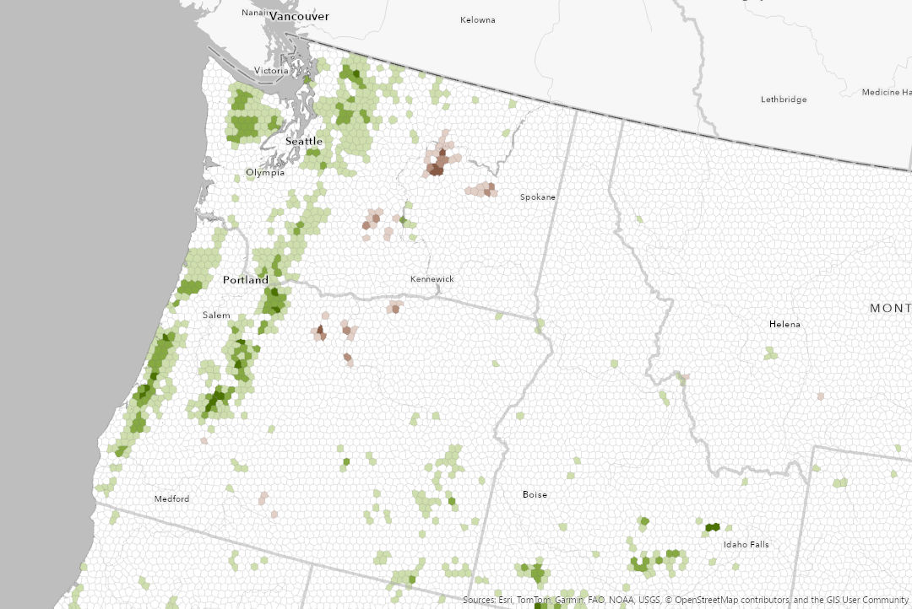

```{r packages, message=FALSE, warning=FALSE, include=FALSE}
library('tidyverse')
```


class: inverse, center, middle

# I am very happy to be here

---
class: inverse, center, middle

# My plan for the day
## Introductions: How do you eat a muffin? and here would you take me in your home town (you are more than your career) ?
## Kick off some code and hope it works
## Discuss my title "Ecologist for The Nature Conservancy's LANDFIRE team"
## See how that code did, demo what I do next in QGIS and GitHub
## Tour a western dry forest project

---

class: inverse, center, middle

# AND discuss whatever is on your mind!

---
class: inverse, center, middle

# Kick off code for the USFWS Fire Folks

---
class: inverse, center, middle

# What is ecology? 

```{r echo=FALSE, message=FALSE, warning=FALSE, out.width="80%", fig.cap="Edward Episcopo/TNC Photo Contest 2021"}
knitr::include_graphics("images/beaver.jpg")
```


---
class: inverse, center, middle

# The Nature Conservancy (TNC, Totally Non-Confrontational :)) is a global environmental nonprofit working to create a world where people and nature can thrive.

---
class: inverse, center, middle

# The Numbers:
## Started in 1951
## > 4,000 employees, ~400 scientists
## All 50 states, working in 76 countries
## Protected over 125,000,000 acres

---
class: inverse, center, middle

## TNC's 2030 Goals

---
class: inverse, center, middle

# Reduce or store 3 gigatons of C02 emissions yearly

https://rswaty.github.io/carbonBlockGroups/dash.html

---
class: inverse, center, middle

# Benefit 100 million people
```{r echo=FALSE, message=FALSE, warning=FALSE, out.width="80%"}
knitr::include_graphics("images/sarahCanoe.jpg")
```


---
class: inverse, center, middle

# Conserve 1.6 billion acres of land
```{r echo=FALSE, message=FALSE, warning=FALSE, out.width="90%"}
knitr::include_graphics("images/vdep.jpg")
```


---
class: inverse, center, middle

# The Nature Conservancy (TNC, Totally Non-Confrontational :)) is a global environmental nonprofit working to create a world where people and nature can thrive.


---

class: inverse, center, middle

# 8,978,751,582
```{r echo=FALSE, message=FALSE, warning=FALSE, out.width="90%"}
knitr::include_graphics("images/bps.jpg")
```

# What is LANDFIRE?
---
class: inverse, center, middle


## LANDFIRE is a shared program between the wildland fire management programs of the U.S. Department of Agriculture Forest Service and U.S. Department of the Interior, providing landscape scale geo-spatial products to support cross-boundary planning, management, and operations. 

---
class: inverse, center, middle


# LANDFIRE:
## Is real people, really
## Produces and delivers dozens of fire, fuel and vegetation datasets
## Updates data every 2 years, moving to a one year update

<br>
# https://landfire.gov/

---


class: inverse, center, middle

## See how that code did, demo what I do next in QGIS and GitHub

---

class: inverse, center, middle

# Western Dry Forests and Fire Project, and two cautionary tales
```{r echo=FALSE, message=FALSE, warning=FALSE, out.width="90%"}

```

---
class: inverse, center, middle

# Some random ideas for your practice

## Try everything in code
## Find quick wins
## Try to reverse engineer cool things
## If you are like me, growing design eye is key
## Conservation Data Lab
---


class: inverse, center, middle


## What is on your mind? 


