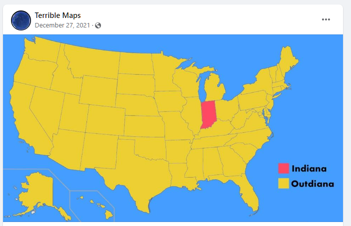
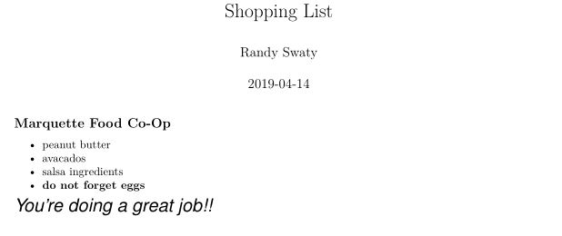
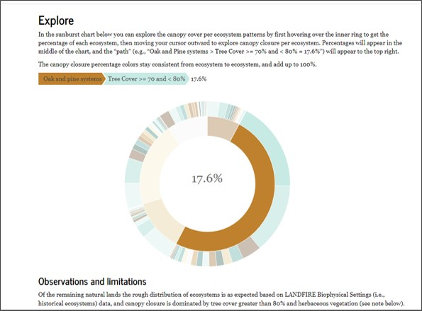

class: inverse, center, middle

# THANK YOU

---
class: inverse, center, middle

# What I do-at least at work

Ecologist for The Nature Conservancy's LANDFIRE team.  

Founder and co-lead of the Conservation Data Lab

https://www.nature.org/en-us/ <br>
https://landfire.gov/ <br>
https://conservationdatalab.org/
---
class: inverse, center, middle

```{r echo=FALSE, message=FALSE, warning=FALSE, out.width="80%"}

```


---
class: inverse, center, middle

# Success equals:
## You start learning to code--or if you code you try something new
## You think about learning in a different way
## We do something good with these skills

---
class: inverse, center, middle

# What is R?

"R is a free software environment for statistical computing and graphics. It compiles and runs on a wide variety of UNIX platforms, Windows and MacOS. To download R, please choose your preferred CRAN mirror.

If you have questions about R like how to download and install the software, or what the license terms are, please read our answers to frequently asked questions before you send an email."

**PLEASE forget all of that**

---
class: inverse, center, middle

# How did I start learning R?

I had a problem.  

---
class: inverse, center, middle

# Next

I started folding R into as many things as possible. 

---
class: inverse, left, middle

# Example 

```{r echo=FALSE, message=FALSE, warning=FALSE, out.width="50%", fig.align='center'}

```


---
class: inverse, left, middle

# Example 2

```{r echo=FALSE, message=FALSE, warning=FALSE, out.width="50%", fig.align='center'}

```


---
class: inverse, left, middle

# Examples 3

### [Conservation Data Lab](https://conservationdatalab.org/)
### [Carbon and People Dashboard](https://rswaty.github.io/carbonBlockGroups/dash.html)
### [Hiawatha National Forest Draft](https://rswaty.github.io/HiawathaNF2022/presentationMay2022.html#1)
### [Online book](https://rswaty.github.io/landfireFSC/)
---
class: inverse, left, middle

# Strategies

Ask yourself "how do I learn best?" <br>
Find a friend or a friend analog <br>
Ask yourself "what do I really do?  How can I fold coding into that?" <br>

*If it's not hard you probably aren't learning*

---
class: inverse, left, middle

# Call to action: Do good with your skills


```{r echo=FALSE, message=FALSE, warning=FALSE, out.width="40%", fig.align='center'}
knitr::include_graphics("images/finnJumps.jpg")
```

*Consider learning, teaching, mentoring in the Conservation Data Lab*

---
class: inverse, left, middle

# Don't forget to do this!


```{r echo=FALSE, message=FALSE, warning=FALSE, out.width="40%", fig.align='center'}
knitr::include_graphics("images/sarahCanoe.jpg")
```


