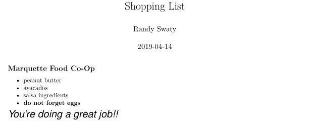

class: inverse, center, middle

# THANK YOU


---
class: inverse, center, middle

# Success:
## You walk away thinking "yeah-I should keep my R skills honed!"
## You think about using R in a new way
## We do something good with these skills

---
class: inverse, center, middle

# My plan

## Ask you some questions :)
## Tell you a little about my work, and how I got into this R maddness
## Showcase some examples and tell a few stories

*And answer questions from you! Please ask away!*

---

class: inverse, center, middle

# Those questions
## Are you math majors?  Ecology/biology?  Econonmics/business?  Something different entirely?
## I'm guessing you have ggplot/tidyverse memorized?  How about ggvis?  Highcharter? Crosstalk? Shiny?
## Are you using R in your other classes?  Maybe in non-data viz ways?

---

class: inverse, center, middle

# What I do-at least at work

Ecologist for The Nature Conservancy's LANDFIRE team.  

Founder and co-lead of the Conservation Data Lab

https://www.nature.org/en-us/ <br>
https://landfire.gov/ <br>
https://conservationdatalab.org/

---
class: inverse, center, middle

```{r echo=FALSE, message=FALSE, warning=FALSE, out.width="80%"}
knitr::include_graphics("images/indiana.PNG")
```

**My father-in-law would often say "Now Randy, don't accomplish something that doesn't accomplish anything"**
---

class: inverse, center, middle

# Why did I start learning R?

I had a problem.  

---
class: inverse, center, middle

# Why did I start learning R?

Reproducibility: that confusing .csv file

---

class: inverse, center, middle

# Next

I started folding R into as many things as possible. 

---
class: inverse, left, middle

# Example 

```{r echo=FALSE, message=FALSE, warning=FALSE, out.width="50%", fig.align='center'}

```


---
class: inverse, left, middle

# Example 2

```{r echo=FALSE, message=FALSE, warning=FALSE, out.width="50%", fig.align='center'}
knitr::include_graphics("images/driftSunburst.jpg")
```


---
class: inverse, left, middle

# Examples 3

### [Conservation Data Lab](https://conservationdatalab.org/)
### [Carbon and People Dashboard](https://rswaty.github.io/carbonBlockGroups/dash.html)
### [Hiawatha National Forest Draft](https://rswaty.github.io/hiawatha2023/)
### [Online book](https://rswaty.github.io/landfireFSC/)

---
class: inverse, left, middle

# Strategies

## Ask yourself "how do I learn best?" <br>
## Ask yourself "what do I really do?  How can I fold coding into that?" <br>
## Organize---my data viz project

*If it's not hard you probably aren't learning*

---
class: inverse, left, middle

# Keep learning!


```{r echo=FALSE, message=FALSE, warning=FALSE, out.width="40%", fig.align='center'}
knitr::include_graphics("images/finnJumps.jpg")
```


---
class: inverse, left, middle

# Keep learning!

## Blogs such as R-Bloggers and R-Weekly
## Google your favorite topics--there's data or a package for that!
## Tidy Tuesdays
## Twitter

**Conservation Data Lab**


---

class: inverse, left, middle

# Don't forget to do this!


```{r echo=FALSE, message=FALSE, warning=FALSE, out.width="40%", fig.align='center'}
knitr::include_graphics("images/sarahCanoe.jpg")
```


