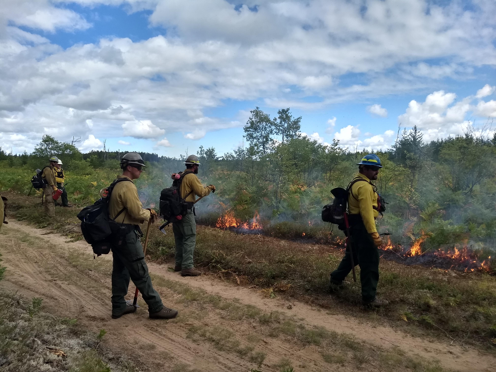

```{r packages, message=FALSE, warning=FALSE, include=FALSE}
library('tidyverse')
```


class: inverse, center, middle

# I am very happy to be here

---
class: inverse, center, middle

# My plan for the day
## Discuss my title "Ecologist for The Nature Conservancy's LANDFIRE team"
## Share a few things I have learned about careers
## Demo a simple collaborative modeling approach

---
class: inverse, center, middle

# What is ecology? 

```{r echo=FALSE, message=FALSE, warning=FALSE, out.width="80%", fig.cap="Edward Episcopo/TNC Photo Contest 2021"}
knitr::include_graphics("images/beaver.jpg")
```


---
class: inverse, center, middle

# The Nature Conservancy (TNC, Totally Non-Confrontational :)) is a global environmental nonprofit working to create a world where people and nature can thrive.

---
class: inverse, center, middle

# The Numbers:
## Started in 1951
## > 4,000 employees, ~400 scientists
## All 50 states, working in 76 countries
## Protected over 125,000,000 acres

---
class: inverse, center, middle

## TNC's 2030 Goals

---
class: inverse, center, middle

# Reduce or store 3 gigatons of C02 emissions yearly

https://rswaty.github.io/carbonBlockGroups/dash.html

---
class: inverse, center, middle

# Benefit 100 million people
```{r echo=FALSE, message=FALSE, warning=FALSE, out.width="80%"}
knitr::include_graphics("images/sarahCanoe.jpg")
```


---
class: inverse, center, middle

# Conserve nearly 10 billion acres of ocean
```{r echo=FALSE, message=FALSE, warning=FALSE, out.width="45%"}
knitr::include_graphics("images/finnJumps.jpg")
```

---
class: inverse, center, middle

# Conserve 1.6 billion acres of land
```{r echo=FALSE, message=FALSE, warning=FALSE, out.width="90%"}
knitr::include_graphics("images/vdep.jpg")
```


---
class: inverse, center, middle

# Support 45 million local stewards
```{r echo=FALSE, message=FALSE, warning=FALSE, out.width="80%"}
knitr::include_graphics("images/grong_stump.jpg")
```


---
class: inverse, center, middle

# The Nature Conservancy (TNC, Totally Non-Confrontational :)) is a global environmental nonprofit working to create a world where people and nature can thrive.


---

class: inverse, center, middle

# 8,978,751,582
```{r echo=FALSE, message=FALSE, warning=FALSE, out.width="90%"}
knitr::include_graphics("images/bps.jpg")
```

# What is LANDFIRE?
---
class: inverse, center, middle


## LANDFIRE is a shared program between the wildland fire management programs of the U.S. Department of Agriculture Forest Service and U.S. Department of the Interior, providing landscape scale geo-spatial products to support cross-boundary planning, management, and operations. 

---
class: inverse, center, middle


# LANDFIRE:
## Is real people, really
## Produces and delivers dozens of fire, fuel and vegetation datasets
## Updates data every 2 years, moving to a one year update

<br>
# https://landfire.gov/

---

class: inverse, center, middle

# Why should you care? Fire.
```{r echo=FALSE, message=FALSE, warning=FALSE, out.width="90%"}

```


---

class: inverse, center, middle

# A little about my path


```{r echo=FALSE, message=FALSE, warning=FALSE, out.width="80%", fig.align='center'}
knitr::include_graphics("images/success.png")
```

# It's been a little up and down shall we say

---
class: inverse, center, top

# My college and career path

<br>
<br>
<br>

## Kitty Gehring - lean in
## Hydraulic hose - own it
## Failed fellowship - keep growing

---

class: inverse, center, middle
# My college story

```{r echo=FALSE, message=FALSE, warning=FALSE, out.width="70%", fig.align='center'}
knitr::include_graphics("images/rysneer.jpg")
```


# Wrote my thesis with this guy in a swing-thanks Kitty!

---
class: inverse, center, top

# Lessons learned in college:
<br>
<br>
<br>
## Find a mentor
## Do things outside of class 
## Get your money's worth

---
class: inverse, center, top

# First job with The Nature Conservancy


```{r echo=FALSE, message=FALSE, warning=FALSE, out.width="70%", fig.align='center'}
knitr::include_graphics("images/grong_falls.jpg")
```

# Hydrualic hoses, and why I was confronted on the street

---
class: inverse, center, middle


```{r echo=FALSE, message=FALSE, warning=FALSE, out.width="40%", fig.align='center'}
knitr::include_graphics("images/me_duck_lake_fire.jpg")
```


# Second job - what I thought I'd be doing

---
class: inverse, center, middle


```{r echo=FALSE, message=FALSE, warning=FALSE, out.width="80%", fig.align='center'}
knitr::include_graphics("images/me_home_office.jpg")
```


# Second job with TNC - what I really do


---
class: inverse, center, middle

# What I do at work

### Get call to assess large landscape = good day
### Mostly e-mails = bad day
### Idea creation = great day
### Someone blames me for something terrible = bad day

<br>

*I do little field work, but have amazing flexibility, and a great community*
---
class: inverse, center, middle

# Also!!! That failed fellowship


```{r echo=FALSE, message=FALSE, warning=FALSE, out.width="80%", fig.align='center'}

```

# Founder and co-lead of the Conservation Data Lab

---
class: inverse, center, middle

```{r echo=FALSE, message=FALSE, warning=FALSE, fig.width=10}
knitr::include_graphics("images/group_lookout.jpg")
```

# Intro to modeling, but first, what do you see?
---
class: inverse, center, middle


```{r echo=FALSE, message=FALSE, warning=FALSE, fig.width=10}
knitr::include_graphics("images/trailer_loading.jpg")
```

# Sometimes you just do what you can
---
class: inverse, center, middle

# Intro to modeling