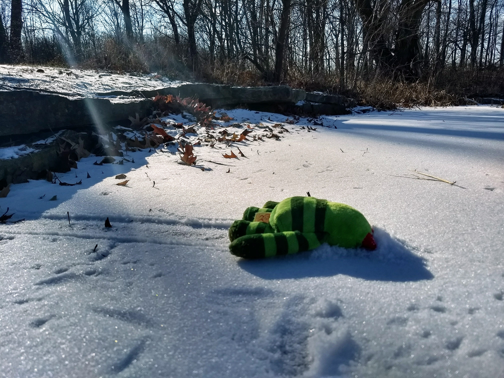

```{r packages, message=FALSE, warning=FALSE, include=FALSE}
library('tidyverse')
```


class: inverse, center, middle

## I sing a song, *if you are OK with this*
## Parsing my title
## Deep dive on historical fire regimes

<br>
<br>

*Disclaimers*

---
class: inverse, center, middle

# Blue, Red and Grey

<br>
<br>
<br>
<br>
<br>
<br>


*You just gave me 2 things*
---
class: inverse, center, middle

# Ecologist for The Nature Conservancy's LANDFIRE Team

<br>
<br>
<br>
<br>
<br>
<br>

**What is an ecologist?  Are you and ecologist?**

---
class: inverse, center, middle

```{r echo=FALSE, message=FALSE, warning=FALSE, fig.width=10}
knitr::include_graphics("images/group_lookout.jpg")
```

**This may be the best way to illustrate TNC as I see it**

---
class: inverse, center, middle


```{r echo=FALSE, message=FALSE, warning=FALSE, fig.width=10}
knitr::include_graphics("images/trailer_loading.jpg")
```

**I was not asked back.  They needed more trust building, and maybe they didn't like me.**
---
class: inverse, center, middle

# The Nature Conservancy (TNC, Totally Non-Confrontational :)) is a global environmental nonprofit working to create a world where people and nature can thrive.

**What do you know about TNC?**

---

class: inverse, center, middle

# The Numbers:
## Started in 1951
## > 4,000 employees, ~400 scientists
## All 50 states, working in 81 countries
## Protected over 125,000,000 acres

---
class: inverse, center, middle

## TNC's 2030 Goals

---
class: inverse, center, middle

# Reduce or store 3 gigatons of C02 emissions yearly

https://rswaty.github.io/carbonBlockGroups/dash.html

---
class: inverse, center, middle

# Conserve nearly 10 billion acres of ocean

```{r echo=FALSE, message=FALSE, warning=FALSE, out.width="40%"}
knitr::include_graphics("images/finnJumps.jpg")
```

---
class: inverse, center, middle


# LANDFIRE


```{r echo=FALSE, message=FALSE, warning=FALSE, fig.width=10}

```

**How is TNC linked to LANDFIRE?**


---
class: inverse, center, middle


# Modeling Historical Fire Regimes


```{r echo=FALSE, message=FALSE, warning=FALSE, out.width='80%'}

```

**Our team ran dozens of workshops with hundreds of experts and a group hug**

---
class: inverse, center, middle


# Modeling Historical Fire Regimes


```{r echo=FALSE, message=FALSE, warning=FALSE, fig.width=10}

```

**SyncroSim used to model historical ecosystem dynamics.  We built 900+ models.**

---
class: inverse, center, middle


# Mapping Historical Ecosystems


```{r echo=FALSE, message=FALSE, warning=FALSE, fig.width=10}
knitr::include_graphics("images/bps.jpg")
```

**Dominant vegetation systems prior to European colonization**

---
class: inverse, center, middle
# Mapping Historical Fire Regimes


```{r echo=FALSE, message=FALSE, warning=FALSE, fig.width=10}

```

**At least 170,000,000 acres of fire in CONUS every year**

---
class: inverse, center, middle


```{r fig.cap='Silly chart', echo=FALSE, message=FALSE, warning=FALSE}
htmltools::tags$iframe(title = "My embedded document", src = "animatedHistCurrPlay.html", frameborder = "0", width = "100%", height="650")
```
