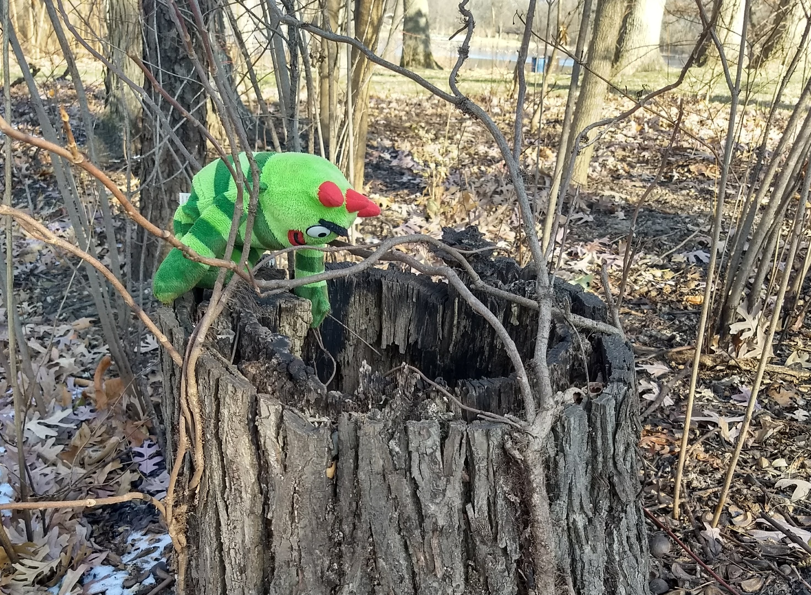

class: inverse, center, middle

# Rapid analysis of fire situation in MI


```{r echo=FALSE, message=FALSE, warning=FALSE, out.width="70%", fig.align='center'}
knitr::include_graphics("images/grong.jpg")
```


Randy Swaty, Fall 2024

---
class: inverse, left, top

# Goals


```{r echo=FALSE, message=FALSE, warning=FALSE, out.width="70%", fig.align='center'}
knitr::include_graphics("images/vdep.jpg")
```


* Look at historical fire regimes
* Explore today's fire exposure, science and action 
* Discuss next steps


---

class: inverse, center, middle

# There was a lot of fire historically

```{r echo=FALSE, message=FALSE, warning=FALSE, out.width="70%", fig.align='center'}
knitr::include_graphics("images/mfri_MI.jpg")
```


---


class: inverse, center, middle

# Which Ecosystems (MFRI < 50yrs) ?

```{r echo=FALSE, message=FALSE, warning=FALSE, out.width="70%", fig.align='center'}

```


---

class: inverse, center, middle

# 1.3 MA annually historically (not today!)


```{r fire bar, echo=FALSE, message=FALSE, warning=FALSE, fig.width=10, fig.height=7}

library(scales)
library(tidyverse)

# read bps attribute table .csv and summarize

fire_data <- read.csv("data/bps_aoi_attributes.csv") %>%
  mutate(annual_fire_acres = ((1/FRI_ALLFIR)*ACRES)) %>%
  filter(BPS_NAME != 'Open Water') %>%
  group_by(BPS_NAME) %>%
  summarize(acres = sum(annual_fire_acres)) %>%
  arrange(desc(acres)) %>%
  na.omit() %>%
  top_n(n = 10, wt = acres)

geographies <- c(
  "Appalachian ",
  "Boreal",
  "Central Interior and Appalachian ",
  "Central Appalachian ",
  "Great Lakes",
  "Laurentian ",
  "Laurentian-Acadian ",
  "North-Central",
  "North-Central Interior ",
  "South-Central Interior ")

fire_data$BPS_NAME <- gsub(paste(geographies, collapse = "|"), "", fire_data$BPS_NAME)


# plot
fireChart <- 
  ggplot(data = fire_data, aes(x = BPS_NAME, y = acres)) +
  geom_bar(stat = "identity") +
  labs(
    title = "Cumulative estimates of all fire types prior to pre-European colonization",
    caption = "Data from landfire.gov",
    x = "",
    y = "Acres") +
  scale_x_discrete(limits = rev(fire_data$BPS_NAME),
                   labels = function(x) str_wrap(x, width = 18)) +
  scale_y_continuous(name = 'Acres', labels = comma) +
  coord_flip() +
  theme_bw(base_size = 14) +
  theme(plot.margin = margin(10, 30, 0, 0))

fireChart

```


---

class: inverse, center, middle

# Current fire occurances


```{r echo=FALSE, message=FALSE, warning=FALSE, out.width="70%", fig.align='center'}
knitr::include_graphics("images/fod.jpg")
```


---

class: inverse, center, middle

# Current fire occurances

```{r fod bar, echo=FALSE, fig.height=6, fig.width=10, message=FALSE, warning=FALSE}
fod <- read.csv("data/mi_fod_clean.csv")

fod_chart <- 
  ggplot(data = fod, aes(x = year, y = acres)) +
  geom_bar(stat = "identity") +
  labs(
    title = "Cumulative annual acres of fires > 500ac, 1984-2022",
    caption = "Data from Short et al., 2023",
    x = "Year",
    y = "Acres") +
  theme_bw(base_size = 14) +
  scale_y_continuous(name = 'Acres', labels = comma) +
  theme(plot.margin = margin(10, 30, 0, 0))

fod_chart
```

Sleeper Lake and Duck Lake fires (2007 and 2012) represent most of highest bars
---

class: inverse, left, top

# More on recent fires

<br>
<br>

* MI DNR burned ~ 6,022ac in 2022 (73 burns).
* ~3,500ac of wildfire in 2022 (376 fires; National Interagency Coordination Center)
* Ottawa averaged ~80ac, Hiawatha ~165 and Huron-Manistee 3,686 over the last 3 years
* Ottawa NF has ~350ac planned, Hiawatha NF ~9,000k ac for 2024
* Did not obtain USFWS plans; found Sleeping Bear has ~1,100ac planned for 2024


<br>
<br>
<br>
## <div align="center">Not comprehensive or authoritative</div>

---

class: inverse, left, middle
# About the need-state lands


```{r echo=FALSE, message=FALSE, warning=FALSE, out.width="55%", fig.align='center'}
knitr::include_graphics("images/mdnr_fire_needs.jpg")
```

From Cohen et al., 2021.  Suggests 12k - 73k acres burning per year needed on state lands (currently burning ~5.5k ac)

---

class: inverse, left, middle
# MI fire needs assessment


```{r echo=FALSE, message=FALSE, warning=FALSE, out.width="55%", fig.align='center'}

```

From McGowan-Stinki et al., 2009.  Suggests ~5m acres in need of fire.

---

class: inverse, left, middle
# About the need-wildfire likelihood


```{r echo=FALSE, message=FALSE, warning=FALSE, out.width="90%", fig.align='center'}

```

From https://wildfirerisk.org/, represents probability of a wildfire in a given year.

---

class: inverse, left, middle
# About the need-wildfire exposure risk


```{r echo=FALSE, message=FALSE, warning=FALSE, out.width="60%", fig.align='center'}
knitr::include_graphics("images/cup_wer.jpg")
```

From Pickhard et al., 2024, https://conservation-data-lab.github.io/cup_assessment/fire.html.  

---

class: inverse, left, middle
# About the need-wildfire exposure risk


```{r echo=FALSE, message=FALSE, warning=FALSE, out.width="70%", fig.align='center'}
knitr::include_graphics("images/mi_wfer_500m.png")
```

Beverly, J.L., McLoughlin, N. and Chapman, E., 2021. A simple metric of landscape fire exposure. Landscape Ecology, 36, pp.785-801. 
---

class: inverse, left, middle

# More on the need

<br>
<br>

* There is not a comprehensive, current fire needs assessment.  
* Climate change is not factored into these assessments (to my knowledge).  
* For some goals and situations harvests should be factored in.  
* "Need" may be defined very broadly, from structure-focused fuels reduction to forward-looking resiliency.
* Additionally-there *could be* carbon-biodiversity-'other' conflicts and situations to assess moving forward.

<br>


---

class: inverse, left, middle

# Current "assets"


```{r echo=FALSE, message=FALSE, warning=FALSE, out.width="60%", fig.align='center'}

```

## <div align="center">People, some momentum (e.g., Hiawatha NF), TNC expertise and a TOC :) </div>

---

class: inverse, left, top

# What I am hearing from Hiawatha and Ottawa National Forests


```{r echo=FALSE, message=FALSE, warning=FALSE, out.width="40%", fig.align='center'}
knitr::include_graphics("images/crocs.jpg")
```

* We have to show up, even if it's just for a beverage
* They are willing to send resources to Slate River
* There are many ways to contribute


---

class: inverse, left, top

# What I am doing

* Keeping up relationships with Hiawatha, Ottawa, USFS Region 9 fire staff
    * Providing maps, charts and summaries as asked
    * Attending meetings and field trips
    * Proposing NMU summer course on fire and monitoring (field and remote)
* Growing relationships with Jill Pritchett and Sienna Falzetta, ecologists with the Huron-Manistee NF
* Across the Midwest I play well with WIBU and MNBU staff including Ann Calhoun, Hannah Spaul, Laura Slavsky, Chris Dunham, Marissa Ahlering
* Trying to update historical ecosystem models when new info comes along
* Connecting dots

<br>

## <div align="center">Is this OK? What would you like for me to be doing? </div>

---

class: inverse, center, middle

# Now what?