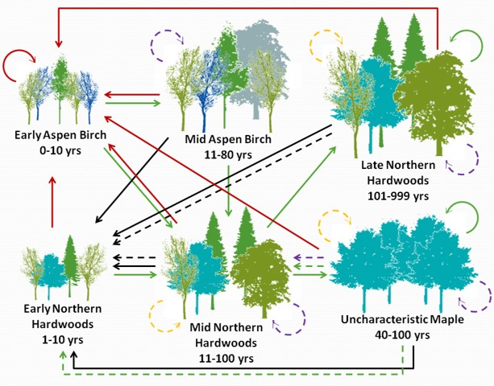

class: inverse, center, middle

# Using LANDFIRE disturbance data for Reforestation Hub, and global models for durability estimation


```{r echo=FALSE, message=FALSE, warning=FALSE, out.width="60%", fig.align='center'}
knitr::include_graphics("images/grong.jpg")
```


Randy Swaty, for NCS team, July 2025

---
class: inverse, left, top

# Goals


* Explore possibility of tracking disturbances with LANDFIRE data (fire plus)
* Demo LANDFIRE Biophysical Settings models, 
* Discuss possible merits of a 'global model set' to estimate durability (very long-shot idea)


<br>
<br>
<br>
<br>

```{r echo=FALSE, message=FALSE, warning=FALSE, out.width="90%", fig.align='center'}
knitr::include_graphics("images/blowdown.jpg")
```


---

class: inverse, left, middle

# What I understand about current post-fire tracking in Reforestation Hub
 <br>

 
 * Used *Hawbaker, T.J., Vanderhoof, M.K., Beal, Y.J., Takacs, J.D., Schmidt, G.L., Falgout, J.T., Williams, B., Fairaux, N.M., Caldwell, M.K., Picotte, J.J. and Howard, S.M., 2017. Mapping burned areas using dense time-series of Landsat data. Remote Sensing of Environment, 198, pp.504-522.*
    * Super solid
    * Developed an algorithm that maps burned areas with LANDSAT and training data as inputs (**great oversimplification**), 1984-1015
    * Captured almost all areas mapped by the US Standard Fire Dataset, MTBS (Monitoring Trends in Burn Severity, USGS, Kurtis Nelson), plus many additional areas

<br>

Limited to fire disturbances and will eventually be out of date for purposes of The Hub. 


---


class: inverse, left, top

# LANDFIRE Disturbance Data
<br>

"LANDFIRE (LF) Annual Disturbance (Dist) products depict where change occurred on the landscape, both spatially and temporally, on an annual basis. These products inform model vegetation transitions to provide updates to LF vegetation, fuel, and fire regime products"
<br>
* Annual data sets available that cover 1999-2023; updated annually
* Mapped from a variety of sources
    * Hawbaker et al 2017 
    * Governmental databases (e.g., Forest Service Activity Tracking System)
    * User submitted 'events' (e.g., state agencies harvesting, fuels reduction)
    * Image analysis/change detection
* Year, disturbance type, severity and confidence level attribution


---

class: inverse, center, middle

# Map #1


```{r echo=FALSE, message=FALSE, warning=FALSE, out.width="80%", fig.align='center'}

```


---

class: inverse, center, middle

# Map #2


```{r echo=FALSE, message=FALSE, warning=FALSE, out.width="80%", fig.align='center'}

```


---
class: inverse, center, middle

# Map #3


```{r echo=FALSE, message=FALSE, warning=FALSE, out.width="80%", fig.align='center'}

```


---

class: inverse, center, middle

# LANDFIRE Biophysical Settings Model-Rapid Primer


```{r echo=FALSE, message=FALSE, warning=FALSE, out.width="80%", fig.align='center'}

```

---
class: inverse, left, top

# Idea and notes


* Use US and Australian models to jump start development of global model set
* Could help distinguish 'natural' from other disturbances 
* Serves as framework for new information
* In US modeled reference vs. current amounts of classes = Vegetation Departure


```{r echo=FALSE, message=FALSE, warning=FALSE, out.width="60%", fig.align='center'}

```


