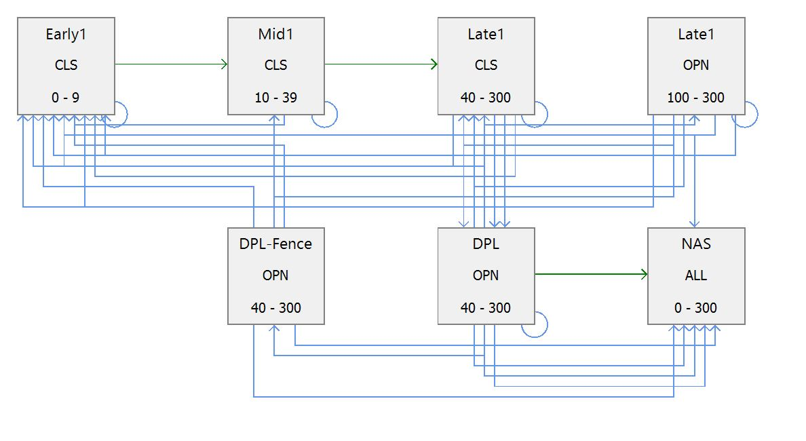

```{r packages, message=FALSE, warning=FALSE, include=FALSE}
library('tidyverse')
```


class: inverse, center, middle

# I am very happy to be here

---
class: inverse, center, middle

# Success =
## You know more about The Nature Conservancy than you already do
## We connect over using LANDFIRE products to teach and/or for research
## Students benefit

---
class: inverse, center, middle

```{r echo=FALSE, message=FALSE, warning=FALSE, fig.width=10}
knitr::include_graphics("images/group_lookout.jpg")
```

---
class: inverse, center, middle


```{r echo=FALSE, message=FALSE, warning=FALSE, fig.width=10}
knitr::include_graphics("images/trailer_loading.jpg")
```


---
class: inverse, center, middle

# The Nature Conservancy (TNC, Totally Non-Confrontational :)) is a global environmental nonprofit working to create a world where people and nature can thrive.

---
class: inverse, center, middle

# The Numbers:
## Started in 1951
## > 4,000 employees, ~400 scientists
## All 50 states, working in 76 countries
## Protected over 125,000,000 acres

---
class: inverse, center, middle

## TNC's 2030 Goals

---
class: inverse, center, middle

# Reduce or store 3 gigatons of C02 emissions yearly

https://rswaty.github.io/carbonBlockGroups/dash.html

---
class: inverse, center, middle

# Benefit 100 million people
```{r echo=FALSE, message=FALSE, warning=FALSE, out.width="80%"}
knitr::include_graphics("images/sarahCanoe.jpg")
```


---
class: inverse, center, middle

# Conserve nearly 10 billion acres of ocean
```{r echo=FALSE, message=FALSE, warning=FALSE, out.width="50%"}
knitr::include_graphics("images/finnJumps.jpg")
```

---
class: inverse, center, middle

# Conserve 1.6 billion acres of land
```{r echo=FALSE, message=FALSE, warning=FALSE, out.width="90%"}
knitr::include_graphics("images/vdep.jpg")
```


---
class: inverse, center, middle

# Support 45 million local stewards
```{r echo=FALSE, message=FALSE, warning=FALSE, out.width="50%"}

```


---
class: inverse, center, middle

# The Nature Conservancy (TNC, Totally Non-Confrontational :)) is a global environmental nonprofit working to create a world where people and nature can thrive.

---
class: inverse, center, middle

# What do I want to collaborate on?
```{r echo=FALSE, message=FALSE, warning=FALSE, out.width="80%"}
knitr::include_graphics("images/collaborate.JPG")
```


---
class: inverse, center, middle


# Using large conservation-focused datasets
# Exploring state and transition models for teaching
# Communicating

Bring in LANDFIRE

---

class: inverse, center, middle

# 8,978,751,582
```{r echo=FALSE, message=FALSE, warning=FALSE, out.width="90%"}
knitr::include_graphics("images/bps.jpg")
```


---
class: inverse, center, middle


## LANDFIRE is a shared program between the wildland fire management programs of the U.S. Department of Agriculture Forest Service and U.S. Department of the Interior, providing landscape scale geo-spatial products to support cross-boundary planning, management, and operations. 

---
class: inverse, center, middle


# LANDFIRE:
## Is real people, really
## Produces and delivers dozens of fire, fuel and vegetation datasets
## Updates data every 2 years, moving to a one year update

---
class: inverse, left, middle


# LANDFIRE products:
## Fire, modeled past and map present (1999-2016 and continuing)
## Historical ecosystems: spatial data, models and descriptions
## Current ecosystems: characteristics and condition
## Fuels: Fire Behavior Fuel Models
## Topographic
---

class: inverse, center, middle

# Why should you care? Fire.
```{r echo=FALSE, message=FALSE, warning=FALSE, out.width="90%"}
knitr::include_graphics("images/fire.jpg")
```


---

class: inverse, center, middle

# Why should you care? Publications.

```{r pubChart, echo=FALSE, message=FALSE, warning=FALSE, fig.width=10}
lf_pubs <- read_csv("data/lf_pubs.csv")

pubChart <- ggplot(data = lf_pubs, aes(x = year, y = number))+
  geom_line(size = 2) +
  theme_bw(base_size = 20) +
  labs(
    x = "Year",
    y = "Number of papers",
    title = "Peer reviewed papers with 'LANDFIRE' as a key word",
    subtitle = "Data from Google Scholar, accessed through 'Publish or Perrish' software"
  )

pubChart

```


---

class: inverse, center, middle

# Why should you care? Teaching ecology. 
```{r echo=FALSE, message=FALSE, warning=FALSE, out.width="90%"}

```


---
class: inverse, left, middle

 <iframe src="animatedHistCurrPlay.html" width="100%" height="500"></iframe>

# One thing I have learned with LANDFIRE data

---

class: center, middle
background-image: url("images/waffle.png")
background-size: contain
---

class: inverse, left, middle

 <iframe src="bigBps.html" width="120%" height="600"></iframe>

---
class: inverse, left, middle


# LANDFIRE:
## Delivers big ecological datasets
## Has produced state and transition models for each ecosystem
## Datasets involved in real land management issues every day

https://landfire.gov/index.php
---
class: inverse, center, middle


# What can we do together:
## Build portfolios (e.g., maps of carbon, LANDFIRE Vegetation Types)

https://wmontillamorantes.myportfolio.com/a

---
class: inverse, center, middle

# Use LANDFIRE models to explore management and disturbance
```{r echo=FALSE, message=FALSE, warning=FALSE, out.width="80%"}

```


---
class: inverse

## NMU Conservation Data Lab members

.pull-left[
- Liz Armstrong (wetlands mapping in MI)
- Scott Benhart (using LiDAR data in WA)
- Cole Bonino (Driftless Region assessment, V1)
- Cassie Begert (fire mapping in the Appalachians)
- Cassidy Downing (GIS analysis, central Wyoming)
]

.pull-right[
- Mary Kelly (learning R/GIS)
- Lea Kemle (mapping for Indigenous Community in AK)
- Rhayna Lillie (learning R/GIS)
- Erin Matula (old growth mapping and more in VT)
- Myles Walimaa (GIS processing in R)
- Gavin White (Driftless Region assessment, V2)
]

Thanks to Matt VG, Suzy Z, Jana N for support!

https://conservationdatalab.org/

---
class: inverse, center, middle

# Cassie's map
```{r echo=FALSE, message=FALSE, warning=FALSE, out.width="80%"}

```


---

class: inverse, center, middle

# Erin's analysis
```{r echo=FALSE, message=FALSE, warning=FALSE, out.width="50%"}

```


---

class: inverse, center, middle

# Gavins's draft map
```{r echo=FALSE, message=FALSE, warning=FALSE, out.width="60%"}

```

---
class: inverse, center, middle

# Let's collaborate
```{r echo=FALSE, message=FALSE, warning=FALSE, out.width="90%"}
knitr::include_graphics("images/MissedFire.jpg")
```


---

class: inverse, center, middle

# I am very happy to be here

