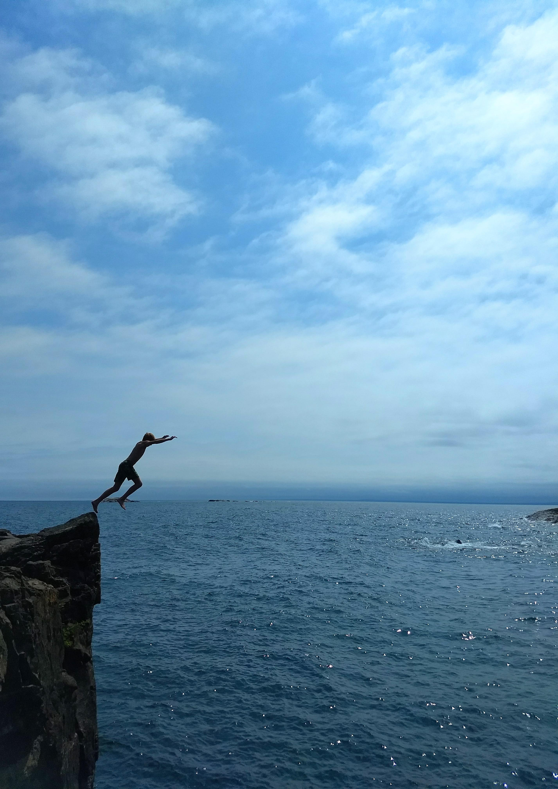

class: inverse, center, middle

# Seize this open-ended craziness: about me, why capstones and some ideas


```{r echo=FALSE, message=FALSE, warning=FALSE, out.width="60%", fig.align='center'}
knitr::include_graphics("images/grong.jpg")
```


Randy Swaty, Ecologist, The Nature Conservancy

---

class: inverse, center, middle

# THANK YOU

yes I am yelling

---
class: inverse, center, middle

# What I do-at least at work

Ecologist for The Nature Conservancy's LANDFIRE team  

Founder and co-lead of the Conservation Data Lab

https://www.nature.org/en-us/ <br>
https://landfire.gov/ <br>
https://conservationdatalab.org/


---
class: inverse, center, middle

# A little about my path


```{r echo=FALSE, message=FALSE, warning=FALSE, out.width="77%", fig.align='center'}
knitr::include_graphics("images/success.png")
```

it's been a little up and down shall we say

---
class: inverse, center, middle

# What I do at work

### Get call to assess large landscape = good day
### Mostly e-mails = bad day
### Idea creation = great day
### Someone blames me for something terrible = bad day

<br>

*I do little field work, but have amazing flexibility, and a great community*

---
class: inverse, center, middle

# What I do at work


```{r echo=FALSE, message=FALSE, warning=FALSE, out.width="90%", out.height="5%",  fig.align='center'}
knitr::include_graphics("images/group_lookout.jpg")
```

---
class: inverse, center, middle

# What I do at work


```{r echo=FALSE, message=FALSE, warning=FALSE, out.width="90%", out.height="5%",  fig.align='center'}
knitr::include_graphics("images/trailer_loading.jpg")
```

---
class: inverse, center, middle

# Why capstones are great

## <div align="center">Real preparation for the next thing</div>

<br>
<br>
<br>

```{r echo=FALSE, message=FALSE, warning=FALSE, out.width="90%", out.height="5%",  fig.align='center'}

```


---
class: inverse, left, middle

# Strategies

## Ask yourself "who, what, how?" 
## Pick one of Dr. Mittlefehldt's ideas 
## Take time to observe 


---
class: inverse, left, middle

# NMU carbon mapping and modeling


```{r echo=FALSE, message=FALSE, warning=FALSE, out.width="40%", fig.align='center'}

```

---
class: inverse, left, middle

# NMU carbon mapping and modeling


```{r echo=FALSE, message=FALSE, warning=FALSE, out.width="100%", fig.align='center'}

```

---
class: inverse, left, middle

# Don't forget to do this!


```{r echo=FALSE, message=FALSE, warning=FALSE, out.width="40%", fig.align='center'}
knitr::include_graphics("images/sarahCanoe.jpg")
```


