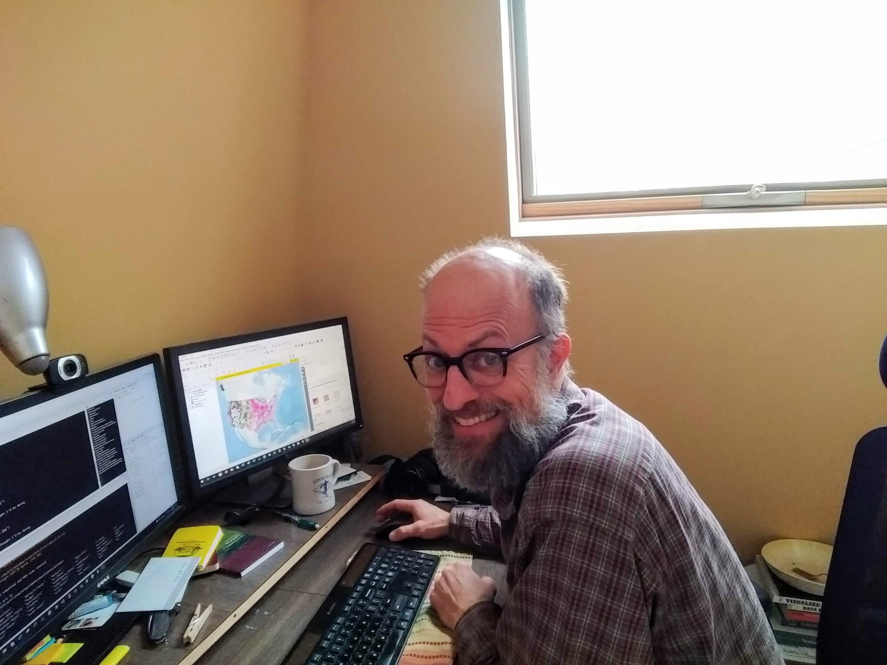
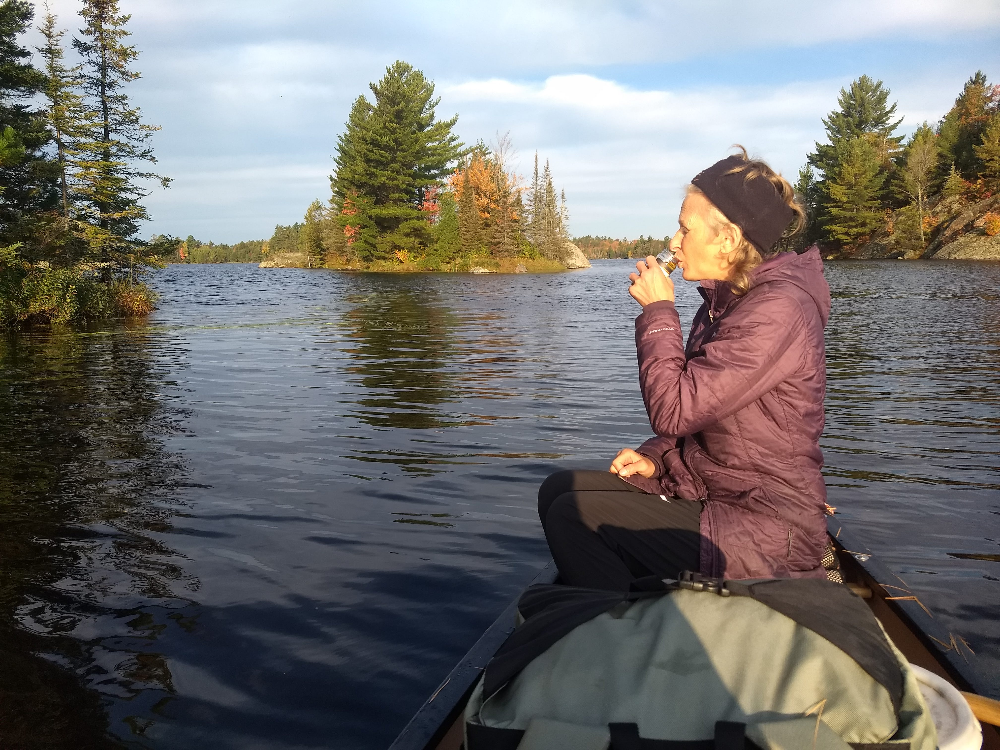

class: inverse, center, middle
# What next?


```{r echo=FALSE, message=FALSE, warning=FALSE, out.width="60%", fig.align='center'}
knitr::include_graphics("images/grong.jpg")
```


Randy Swaty, Ecologist, The Nature Conservancy

---

class: inverse, center, middle

# THANK YOU

yes I am yelling


---
class: inverse, center, top

# Today:

<br>
<br>
<br>

## A little bit about my path
## A day in the life of me
## A rant, and call to action


---
class: inverse, center, middle

# A little about my path


```{r echo=FALSE, message=FALSE, warning=FALSE, out.width="77%", fig.align='center'}
knitr::include_graphics("images/success.png")
```

It's been a little up and down shall we say

---

class: inverse, center, middle


```{r echo=FALSE, message=FALSE, warning=FALSE, out.width="70%", fig.align='center'}
knitr::include_graphics("images/rysneer.jpg")
```


Wrote my thesis with this guy in a swing

---
class: inverse, center, top

# Lessons learned:
<br>
<br>
<br>
## Find a mentor
## Do things outside of class 
## Don't let school squash your curiousity

---
class: inverse, center, top

# First job with The Nature Conservancy
<br>
<br>
<br>
## What is The Nature Conservancy?
## What I was hired to do :)
## Why the environmentalists hated me

---
class: inverse, center, middle


```{r echo=FALSE, message=FALSE, warning=FALSE, out.width="30%", fig.align='center'}
knitr::include_graphics("images/me_duck_lake_fire.jpg")
```


Second job with TNC, what I thought I'd be doing

---
class: inverse, center, middle


```{r echo=FALSE, message=FALSE, warning=FALSE, out.width="70%", fig.align='center'}

```


Second job with TNC, what I really do

---
class: inverse, center, middle

# What I do-at least at work

Ecologist for The Nature Conservancy's LANDFIRE team  

Founder and co-lead of the Conservation Data Lab

https://www.nature.org/en-us/ <br>
https://landfire.gov/ <br>
https://conservationdatalab.org/

---
class: inverse, center, middle

# What I do at work

### Get call to assess large landscape = good day
### Mostly e-mails = bad day
### Idea creation = great day
### Someone blames me for something terrible = bad day

<br>

*I do little field work, but have amazing flexibility, and a great community*

---
class: inverse, center, middle

# What I do at work


```{r echo=FALSE, message=FALSE, warning=FALSE, out.width="90%", out.height="5%",  fig.align='center'}
knitr::include_graphics("images/group_lookout.jpg")
```

---
class: inverse, center, middle

# What I do at work


```{r echo=FALSE, message=FALSE, warning=FALSE, out.width="90%", out.height="5%",  fig.align='center'}
knitr::include_graphics("images/trailer_loading.jpg")
```

## <div align="center">*Any questions about my job?* </div>
---
class: inverse, center, middle

# What do you plan to do?
## Grad school?
## Start a business?
## Travel?
## Work?
## Some or all of the above?
---
class: inverse, center, middle

# Regardless...
## You are smart, creative, energetic, amazing
## You know how to do things (or know how to figure it out)
## You have a story to tell


---

class: inverse, center, middle

# The Rant you've been waiting for
## In school you are quizzed, tested
## Write papers...
## Rarely get to interact with professionals

<br>

I am not saying universities are bad...


---
class: inverse, center, middle

# Make a portfolio website

https://mtango99.github.io/

Turn what you do into something bigger

---
class: inverse, center, middle

# The opportunity
## How can you take what you already know/do and turn it into something?
## Do you know what you know/don't know?  How can you fill in the gaps?
## What would make you happy?

---

class: inverse, center, middle

# Something to consider

https://conservationdatalab.org/

Makes me happy anyways

---
class: inverse, center, middle


# Some next steps

<br>


### ECOLOG, https://www.esa.org/membership/ecolog/
### International Association of Landscape Ecology https://www.ialena.org/
### Society for Conservation GIS https://scgis.org/
### Society for Conservation Biology https://conbio.org/
### The Nature Conservancy

---
class: inverse, center, middle


# That pesky resume

<br>

### You have 3-4 drafts to go
### Use chatGPT (with caution and ethically of course)
### Hit up career center (you pay them!)
### Get review from anyone
### Look into different formats

---
class: inverse, center, middle

# Questions?


```{r echo=FALSE, message=FALSE, warning=FALSE, out.width="70%", out.height="5%",  fig.align='center'}

```


