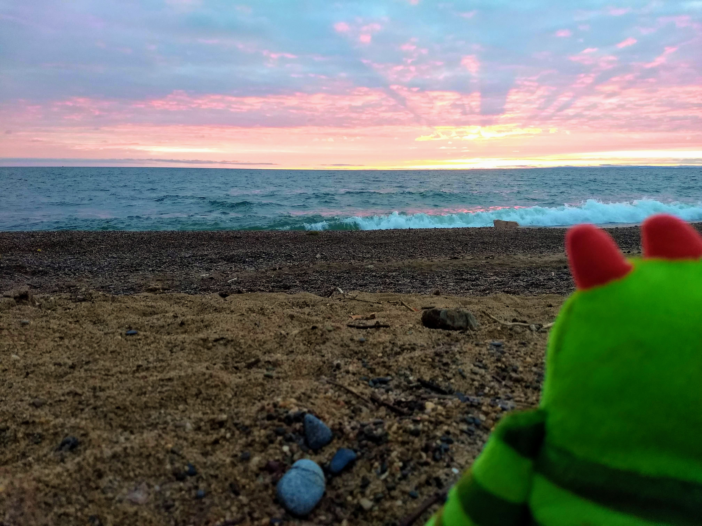
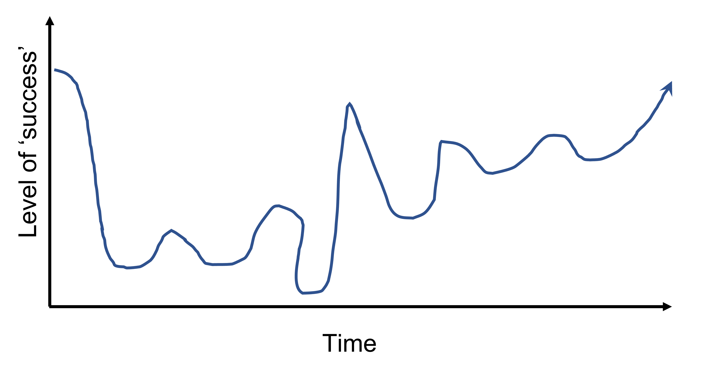
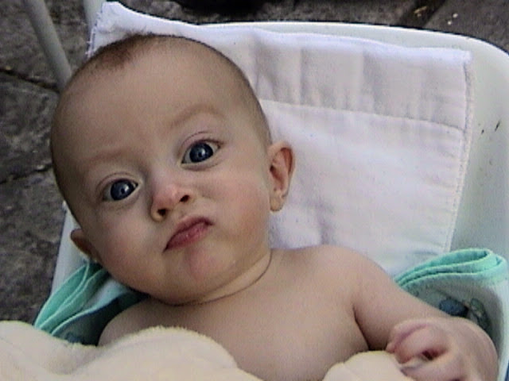
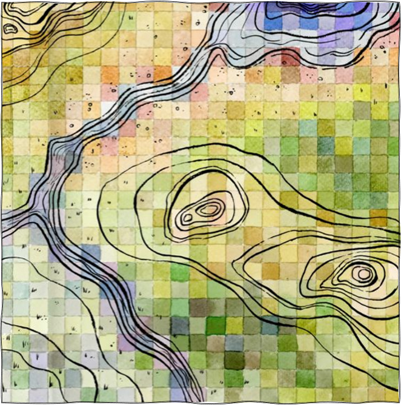

class: inverse, center, middle
# My quick take on protected areas management, data and being a geek


```{r echo=FALSE, message=FALSE, warning=FALSE, out.width="60%", fig.align='center'}

```


Randy Swaty, Ecologist, The Nature Conservancy (note-I'm high a high context communicator)

---

class: inverse, center, middle

# THANK YOU

yes I am yelling-and a little bit about Andrea


---
class: inverse, center, top

# My plan for today

<br>
<br>
<br>

## Intros/icebreaker
## A little bit about my path 
## An oversimplified look at ecology and protected areas


---

class: inverse, center, middle

# A little about my path


```{r echo=FALSE, message=FALSE, warning=FALSE, out.width="77%", fig.align='center'}

```

It's been a little up and down shall we say

---

class: inverse, center, middle
# My college experience

```{r echo=FALSE, message=FALSE, warning=FALSE, out.width="70%", fig.align='center'}

```


Wrote my thesis with this guy in a swing

---
class: inverse, center, top

# Lessons learned:
<br>
<br>
<br>
## Find a mentor
## Do things outside of class 
## Don't let school squash your curiousity


---
class: inverse, center, middle

# What I do-at least at work

Ecologist for The Nature Conservancy's LANDFIRE team  

Founder and co-lead of the Conservation Data Lab

https://www.nature.org/en-us/ <br>
https://landfire.gov/ <br>
https://conservationdatalab.org/

---
class: inverse, center, middle

# What I do at work

### Get call to assess large landscape = good day
### Mostly e-mails = bad day
### Idea creation = great day
### Someone blames me for something terrible = bad day

<br>

*I do little field work, but have amazing flexibility, and a great community*

---
class: inverse, center, middle

# What I do at work


```{r echo=FALSE, message=FALSE, warning=FALSE, out.width="90%", out.height="5%",  fig.align='center'}
knitr::include_graphics("images/group_lookout.jpg")
```

---
class: inverse, center, middle

# What I do at work


```{r echo=FALSE, message=FALSE, warning=FALSE, out.width="90%", out.height="5%",  fig.align='center'}
knitr::include_graphics("images/trailer_loading.jpg")
```

## <div align="center">*Any questions about my job?* </div>
---

class: inverse, center, middle

# What to do where


```{r echo=FALSE, message=FALSE, warning=FALSE, out.width="50%", out.height="5%",  fig.align='center'}

```

Painting by NMU student Leo Barch, inspired by Robyn Holmes (https://watercyclecolors.com/)

---

class: inverse, center, middle

# Quick LANDFIRE based ecology lesson


```{r echo=FALSE, message=FALSE, warning=FALSE, out.width="50%", out.height="5%",  fig.align='center'}

```

Now to learn why you don't see my work in a museum :)

---

class: inverse, center, top

# Looking to the past-your job

<br>

https://rswaty.github.io/national_forests/dashboard.html

<br>


### Click and explore the report from one national forest
### Be skeptical (I'll share a reason why).  Come up with 3 questions for me.  Write them down.
### Prepare to discuss.  I just might call on you.

---

class: inverse, center, top

# As you start to manage

<br>

### https://landfire.gov/
### https://www.inaturalist.org/
### https://gee-community-catalog.org/
### https://datasources.speciesmonitoring.org/
### https://crcs.tnc.org/
### https://www.planscape.org/  NOTE: there are more and more of these tools popping up


