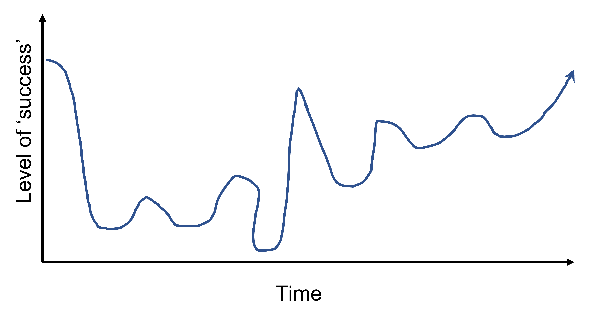
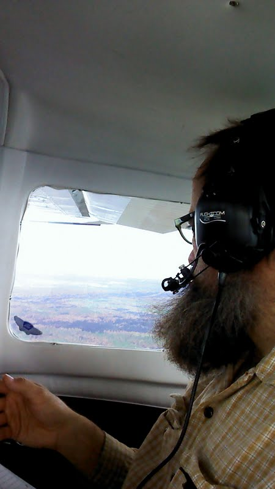

```{r packages, message=FALSE, warning=FALSE, include=FALSE}
library('tidyverse')
```


class: inverse, center, middle

# I am very happy to be here

---
class: inverse, center, middle

# Success =
## You think of school as much more than just courses
## Y'all are primed for success on Friday
## I hear from some of you some day!

---
class: inverse, center, middle

# Questions for you first:
## Where are you from?  Who's from Idaho?  ZOOM folks please enter your locale in the chat.
## How many of you have a job in addition to school?
## How many of you have hobbies?  Gardening, gaming, golfing, geocaching?
## How many of you are doing **your** part to get your money's worth from U of ID?

---
class: inverse, center, middle

# A little about my path


```{r echo=FALSE, message=FALSE, warning=FALSE, out.width="77%", fig.align='center'}

```

It's been a little up and down shall we say

---

class: inverse, center, middle


```{r echo=FALSE, message=FALSE, warning=FALSE, out.width="30%", fig.align='center'}

```


This is what I thought I'd be doing as an ecologist for **The Nature Conservancy's LANDFIRE** team

*QUESTIONS FOR ME?*


---
class: inverse, center, middle

# The Nature Conservancy (TNC, Totally Non-Confrontational :)) is a global environmental nonprofit working to create a world where people and nature can thrive.

---
class: inverse, center, middle

# The Numbers:
## Started in 1951
## > 4,000 employees, ~400 scientists
## All 50 states, working in 76 countries
## Protected over 125,000,000 acres

*QUESTIONS FOR ME?*
---

class: inverse, center, middle

```{r echo=FALSE, message=FALSE, warning=FALSE, fig.width=10}

```

What is LANDFIRE?

*From landfire.gov*

---


class: inverse, center, middle

```{r echo=FALSE, message=FALSE, warning=FALSE, fig.width=10}
knitr::include_graphics("images/group_lookout.jpg")
```

What do you notice about the people?

---
class: inverse, center, middle


```{r echo=FALSE, message=FALSE, warning=FALSE, fig.width=10}
knitr::include_graphics("images/trailer_loading.jpg")
```

Still sometimes things just don't work out. 

---
class: inverse, center, middle
# Let's talk jobs for a sec

## nature.org
## What we (and probably others) look for: grit and hunger
## ECOLOG !!

*QUESTIONS FOR ME?*

---
class: inverse, center, middle
# Take home messages

## Cultivate positive relationships
## Identify and grow positive aspects of yourself (and learn how to communicate them)
## Lean in.  Give it.  5% more.

*On to modeling and our Friday Lab*

---
class: inverse, center, middle
# Why model?

## We need a way to understand ecosystems
## Test management strategies
## Build consensus

**It does work sometimes :)**

---

class: inverse, center, middle


# On to our Aspen exercise
